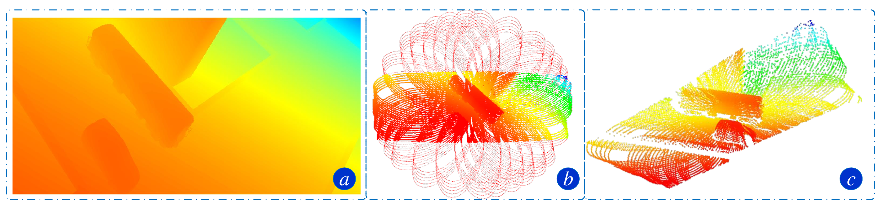
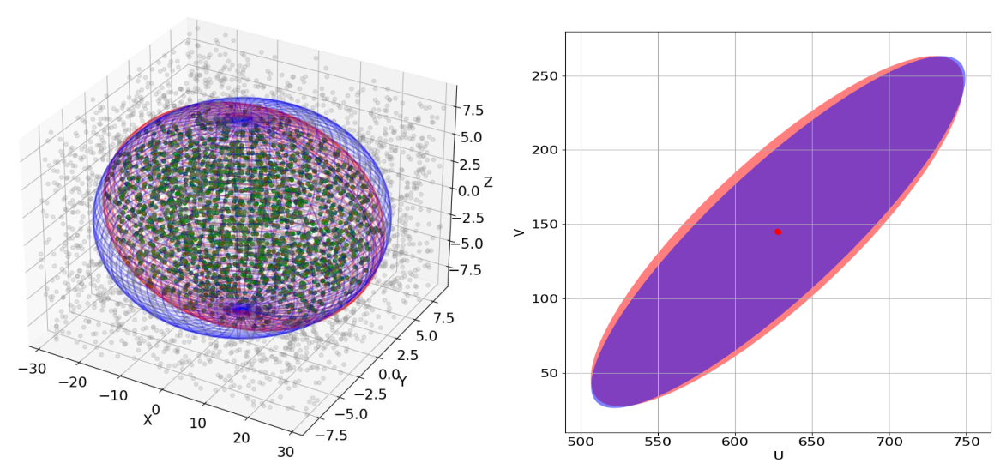

# Synthesized-Multimotion-and-Modeling-dataset
A Synthesized Multimotion and Modeling dataset evaluating ego-motion, object scale estimation and 3D tracking performance evaluation.

**Muliti-Sensor Configuration:**
<blockquote>
The simulator supports multi-sensor configurations and currently offers RGB, RGB-D, and LiDAR data options for selection.

For example, the process of generating simulated LiDAR data is shown as follows. Firstly, using OpenGL to render a depth image that aligns with the field of view (FOV) of the LiDAR. Subsequently, an octree map is employed to store the point clouds in the camera frame. Finally, employing the predefined LiDAR scan pattern, ray casting is executed to convert the depth image into simulated LiDAR data.
</blockquote>

**Videos:**

***Sequence-1 (Ball & Skateboard)***

***Sequence-2 (Cube & Cuboid)***

***Sequence-3 (Subway & Car)***

***Evaluate Metrics***

**The 3D/2D Intersection over Union (IoU)**
<blockquote>
Since our method models objects as quadrics, the conventional 3D bounding box IoU evaluation strategy is not appropriate for our method. Consequently, we introduced new evaluation metrics based on 3D IoU and 2D IoU. Due to the irregular geometry formed by the intersection of two ellipsoids with different coordinate origins, it is challenging to calculate the volume analytically. Therefore, we employ the Monte Carlo algorithm to compute the 3D IoU. In following picture, the blue ellipsoid represents the estimated ellipsoid, the red ellipsoid represents the reference ellipsoid, and the green point clouds represents the points within the intersection region. For the 2D IoU, we project the quadric onto a rotated rectangle and utilize the Vatti clipping algorithm to calculate the intersection area.
</blockquote>

**Absolute pose error (APE) & Relative pose error (RPE)**
<blockquote>
Our simulator can provide the ground truth poses of objects in the environment and ego-camera, which can be used for quantitative evaluation for them.
</blockquote>
 

